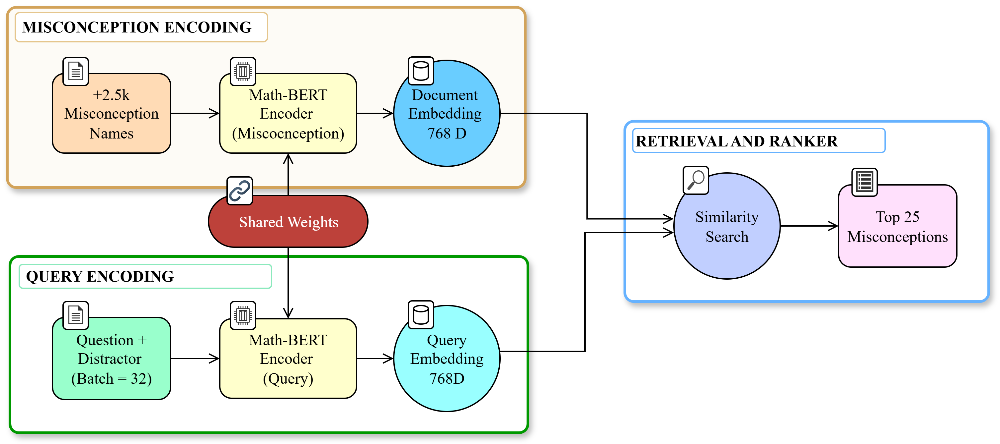

# Math-BERT Dense Retriever: Bi-Encoder for Misconception Mapping

This project demonstrates a specialized **Dense Retrieval** pipeline designed to map student mathematical errors to a pedagogical taxonomy of misconceptions. This system was developed as a core component of my thesis: *"Detecting Mathematical Misconceptions through Dense Retrieval and LLM Reasoning."*

> **Note:** The source code and training scripts for this project are currently held in a private repository pending final thesis publication. This page serves as a technical overview of the architecture and performance results.

## 🎯 Project Objective
In automated math tutoring, identifying *why* a student is wrong is a critical prerequisite for effective feedback. This retriever acts as a domain-specific search engine that, given a **Question + Student's Incorrect Answer**, retrieves the most relevant misconception from a structured database of over 2,500 definitions.

## 🏗️ System Architecture
The system utilizes a **Bi-Encoder (Dual-Encoder)** framework to achieve efficient, high-speed retrieval.

  
*Figure 1: High-level overview of the Bi-Encoder architecture. Both the query (Question + Student Error) and the misconception corpus are mapped into a shared 768-dimensional latent space.*

* **Shared Weights:** Both encoders utilize the **Math-BERT** backbone to ensure consistent embedding of mathematical notation and LaTeX symbols.
* **Scalable Retrieval:** By pre-embedding the misconception corpus, we perform similarity searches using a dot-product approach, allowing the system to scale to large pedagogical datasets.

## 🧠 Training Strategy: Vector Space Optimization
To fine-tune the retriever, I implemented **Multiple Negatives Ranking Loss (MNRL)**. This contrastive learning approach is essential for creating a highly discriminative embedding space.

  
*Figure 2: Visualization of the latent space optimization. The loss function minimizes the distance between the query and its ground-truth misconception (positive) while maximizing the distance from other misconceptions in the training batch (negatives).*

### Technical Implementation Details:
* **Backbone:** `math-similarity/Bert-MLM_arXiv-MP-class_zbMath` — specialized for mathematical semantics.
* **Contrastive Learning:** By treating all other misconceptions in a batch as "in-batch negatives," the model learns to identify the unique "error signature" of a specific mathematical misunderstanding.
* **Layer Freezing:** I implemented a partial freeze on the first **4 out of 12 Transformer layers** to preserve robust low-level features while adapting higher-level layers to the misconception mapping task.

## 📊 Performance Metrics (Test Set)
The model is optimized for **Recall**, ensuring the correct misconception is captured within the top candidates for a subsequent reranking stage.

| Metric | Score | Significance |
| :--- | :--- | :--- |
| **Recall@25** | **93.14%** | The correct concept is retrieved in the top 25 candidates in ~93% of cases. |
| **Recall@5** | **85.10%** | Demonstrates strong density in the immediate top results. |
| **Acc@1** | **63.88%** | Baseline "Top-1" accuracy without any secondary reasoning or reranking. |
| **mAP@10** | **0.7319** | Strong ranking quality within the top 10 results. |

## 🛠️ Implementation & Scalability
* **FAISS Integration:** While evaluation uses standard dot-product, the repository includes a **FAISS (IndexFlatIP)** implementation to demonstrate how the retriever scales to millions of documents with sub-millisecond latency.
* **Experiment Tracking:** Integrated with **Weights & Biases (WandB)** for hyperparameter optimization and loss curve monitoring.
